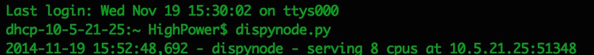
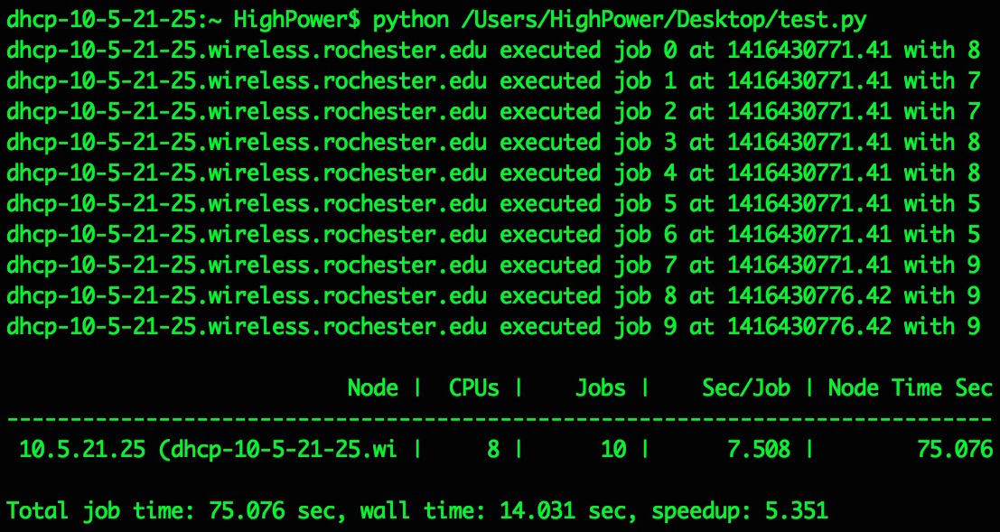

#CS453 Final Project Update
Dispy : Python Framework for Distributed and Parallel Computing
##Group Member
Xi Jin & Hao Xu
## Installation and Components Introduction
Since we use Python 2.7.8 in this project. We can install Dispy with:
```Bash
pip install dispy
```
Dispy consists of 4 components:

_dispy_ (client) provides two ways of creating “clusters”: JobCluster() when only one instance of dispy may run and SharedJobCluster() when multiple instances may run (in separate processes). If JobCluster() is used, the job scheduler is included in it will distribute jobs on the server nodes; if SharedJobCluster() is used, a separate scheduler (dispyscheduler) must be running.

_dispynode_ executes jobs on behalf of dispy. dispynode must be running on each of the (server) nodes that form the cluster.

_dispyscheduler_ is needed only when SharedJobCluster() is used; this provides a scheduler that can be shared by multiple dispy clients simultaneously.

_dispynetrelay_ is needed when nodes are located across different networks. If all nodes are on local network or if all remote nodes can be listed in ‘nodes’ parameter when creating cluster, there is no need for dispynetrelay - the scheduler can discover such nodes automatically. However, if there are many nodes on remote network(s), dispynetrelay can be used to relay information about the nodes on that network to scheduler, without having to list all nodes in ‘nodes’ parameter.
## Local Test
To test dispy is working on our local machine, consider the following program, in which function compute is distributed to nodes on a local network for parallel execution. First, run dispynode program (‘dispynode.py’) local machine:



Now run the program below, which creates a cluster with function compute; this cluster is then used to create jobs to execute compute with a random number 10 times:
```Python
# 'compute' is distributed to each node running 'dispynode';
# runs on each processor in each of the nodes
def compute(n):
    import time, socket
    time.sleep(n)
    host = socket.gethostname()
    return (host, n)

if __name__ == '__main__':
    import dispy, random
    cluster = dispy.JobCluster(compute)
    jobs = []
    for n in range(10):
        # run 'compute' with a random number between 5 and 10
        job = cluster.submit(random.randint(5,10))
        job.id = n
        jobs.append(job)
    # cluster.wait() # wait for all scheduled jobs to finish
    for job in jobs:
        host, n = job() # waits for job to finish and returns results
        print('%s executed job %s at %s with %s' % (host, job.id, job.start_time, n))
        # other fields of 'job' that may be useful:
        # print(job.stdout, job.stderr, job.exception, job.ip_addr, job.start_time, job.end_time)
    cluster.stats()
```
