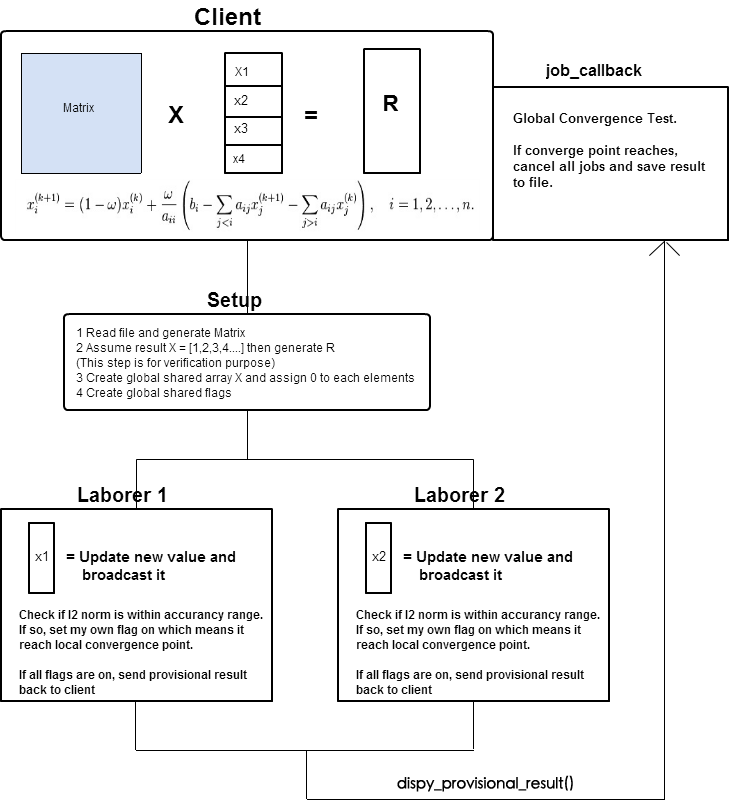
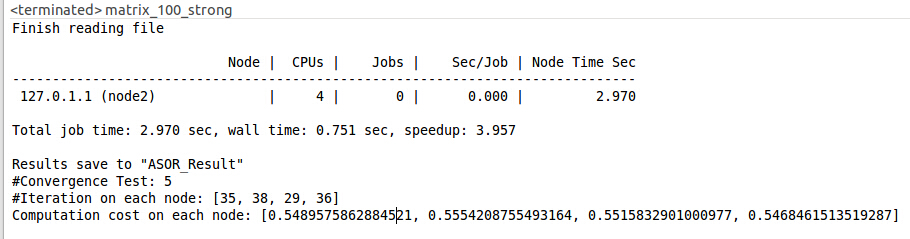

#CS453 Final Project Update
Dispy : Python Framework for Distributed and Parallel Computing
##Group Member
Xi Jin & Hao Xu
## Introduction
`Dispy` is a Python framework for parallel execution of computations by distributing them across multiple processors in a single machine (SMP). It is implemented with `asyncoro`, which is an independent framework for asynchronous and concurrent programming with coroutines. Dispy itself is well suited for data parallel (SIMD) paradigm where a computation is evaluated with different (large) datasets independently with no communication among computation tasks. When there is some communications among workloads, we need asyncoro framework to help passing message. The asyncore is like a message passing model for communicating with client and other computation tasks.
## Motivation

Solving linear system is a classical problem in many areas. Our main purpose is to solve a linear system by using successive over-relaxation algorithm.
This algorithm is a converging iterative process which can be implemented into synchronous or asynchronous version. For linear system: . Assume  can be decomposed into a diagonal component , and strictly lower and upper triangular components  and : . 

The system of linear equations may be rewritten as:
<p align="center"></p>

Then 
<p align="center"></p>

We now focus on asynchronous version in Python with the help of dispy and asyncoro. Also we would like to know how Python could be a concise language than C and what the performance difference between them is.
## Installation and Components Introduction
Since we use Python 2.7.8 in this project. We can install Dispy with:
```Bash
pip install dispy
```
Dispy consists of 4 components:

_dispy_ (client) provides two ways of creating “clusters”: JobCluster() when only one instance of dispy may run and SharedJobCluster() when multiple instances may run (in separate processes). If JobCluster() is used, the job scheduler is included in it will distribute jobs on the server nodes; if SharedJobCluster() is used, a separate scheduler (dispyscheduler) must be running.

_dispynode_ executes jobs on behalf of dispy. dispynode must be running on each of the (server) nodes that form the cluster.

_dispyscheduler_ is needed only when SharedJobCluster() is used; this provides a scheduler that can be shared by multiple dispy clients simultaneously.

_dispynetrelay_ is needed when nodes are located across different networks. If all nodes are on local network or if all remote nodes can be listed in ‘nodes’ parameter when creating cluster, there is no need for dispynetrelay - the scheduler can discover such nodes automatically. However, if there are many nodes on remote network(s), dispynetrelay can be used to relay information about the nodes on that network to scheduler, without having to list all nodes in ‘nodes’ parameter.
## Framework
Set up global variables and preprocess the data
```Python
def setup():
    pass
```
Clean up global variables, close file and etc.
```Python
def cleanup():
    pass
```
Function running on the laborers
```Python
def compute(#parameters from client#):
    return  0
```
When a job’s results become available, dispy will call provided callback function with that job as the argument. If a job sends provisional results with ‘dispy_provisional_result’ multiple times, then dispy will call provided callback each such time.

The (provisional) results of computation can be retrieved with ‘result’ field of job, etc. While computations are run on nodes in isolated environments, callbacks are run in the context of user programs from which (Shared) JobCluster is called - for example, callbacks can access global variables in programs that created cluster(s).

The interesting part here is we can check if this intermediate result satisfies the client. If it does, the client can stop all the jobs.
```Python
# When laborers send dispy_provisional_result back to client, client will run this function     
def job_callback(job):
    if job.status == dispy.DispyJob.ProvisionalResult:
        if "meet criteria (results satisfy client)":    
            for j in jobs:
                if j.status in [dispy.DispyJob.Created, dispy.DispyJob.Running,
                                dispy.DispyJob.ProvisionalResult]:
                    cluster.cancel(j) #then stop all the jobs
```
```Python
# running on client
if __name__ == '__main__':
# Create job cluster
    cluster = dispy.JobCluster(compute,setup=setup,cleanup=cleanup,callback=job_callback)
# Assign jobs
    job_num = 10
    jobs = []
    for n in range(job_num):
        job = cluster.submit(#parameters pass to laborers#)
        job.id = n
        jobs.append(job)
    cluster.wait() # waiting for all jobs done
    for job in jobs:
        job()
    cluster.stats()
```
##Algorithm
```
Solving a linear system : AX=b (A is PSD matrix)
Algorithm:
Inputs: A, b, ω (relaxation factor), X
Choose an initial guess X to the solution
repeat until convergence
for i from 1 until n do
	tmp = 0
	old= X[i];
	for j from 1 until n do
		if j != i then
 			tmp = tmp + a[i][j] X[j] // numpy function applied here to gain efficiency
	end (j-loop)
 	X[i] = (1 - ω)*old+ ω / a[i][i] (bi - tmp)
end (i-loop)
check if convergence is reached
end (repeat)
```
## Complete Code
Please see [here](https://github.com/highpowerxh/CSC453BlogPost/blob/master/ASOR.py)

Flow Chart:


## Performance Testing
<iframe width="600" height="371" seamless frameborder="0" scrolling="no" src="https://docs.google.com/spreadsheets/d/1qa5pDeNa5kOfO1qysL1jq8sD9LMef67zhscOidCFW_I/pubchart?oid=894190270&amp;format=interactive"></iframe>
**Comparison with C is in progress**

Here is a screenshot of a single run:



Note: We didn't find SMP support in Dispy as it described in their document. Actually, it provides an MPI-like parallelism, so data does not have better locality performance. The final comparsion will seem to be a little unfair for dispy since the C version is using pthread which has better memory locality. But dispy version has only about 150 lines of code after clean up compare to the 600 lines of C version.

We'll test dispy version on multipy machines if possible
##Reference
[1] Dispy: http://dispy.sourceforge.net

[2] Asyncoro: http://asyncoro.sourceforge.net/

[3] Renato de Leone. Partially and totally asynchronous algorithms for linear complementarity problems. _Journal of optimization theory and applications_, 69(2):235–249, 1991.

[4] R De Leone and Olvi L Mangasarian. Asynchronous parallel successive overrelaxation for the symmetric linear complementarity problem. _Mathematical Programming_, 42(1-3):347–361, 1988.

[5] Olvi L Mangasarian. Solution of symmetric linear complementarity problems by iterative methods. _Journal of Optimization Theory and Applications_, 22(4):465–485, 1977.

[6] Olvi L Mangasarian and R De Leone. Parallel successive overrelaxation methods for symmetric linear complementarity problems and linear programs. _Journal of Optimization Theory and Applications_, 54(3):437–446, 1987.